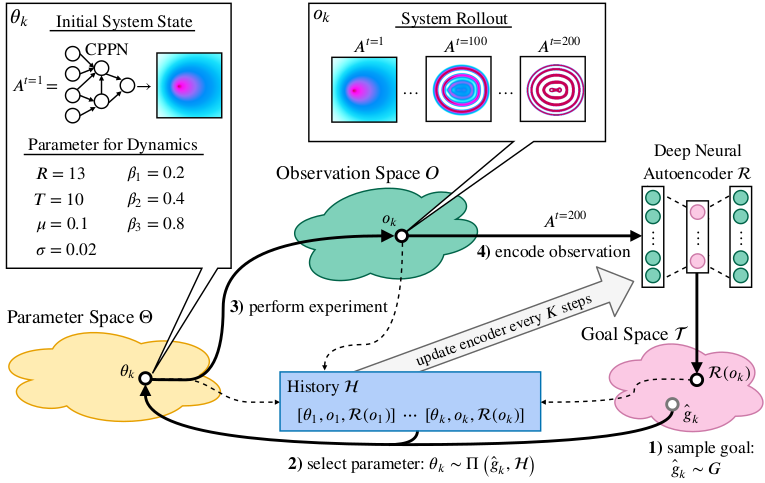
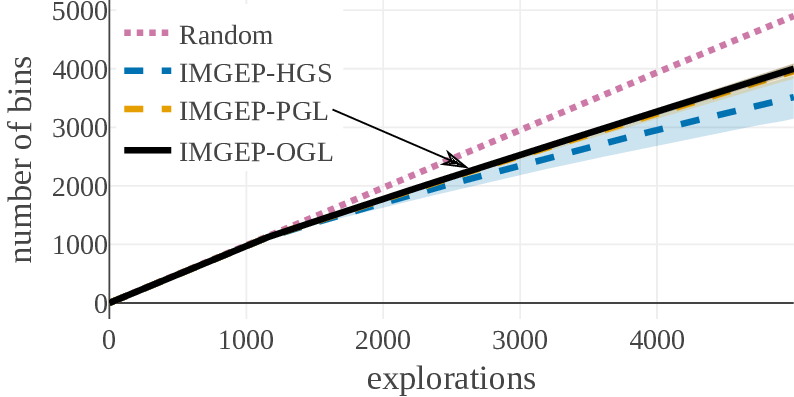
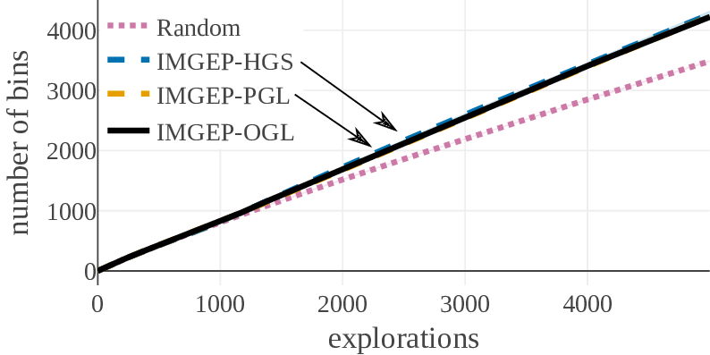
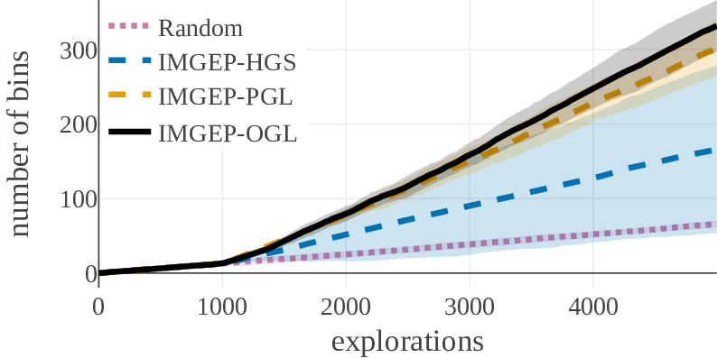

## Intrinsically Motivated Exploration for Automated Discovery of Patterns in Morphogenetic Systems

[[Download the Paper]](./assets/media/paper/Automated_Discovery.pdf)
{: style="color:gray; font-size: 150%; text-align: center;"}

Intrinsically motivated goal exploration processes (IMGEPs) were shown to enable autonomous agents to efficiently explore and map the diversity of the effects they can produce on their environment.
With IMGEPs, agents self-define their own experiments by imagining goals, then try to achieve them by leveraging their past discoveries.
Progressively they learn which goals are achievable and which are not.
IMGEPs were shown to enable efficient discovery and learning of diverse repertoires of skills in high-dimensional robots.

We show that the IMGEP framework can also be used in an entirely different application area: automated discovery of self-organized patterns in complex morphogenetic systems.
We also introduce a new IMGEP algorithm where goal representations are learned online and incrementally (past approaches used precollected training data with batch learning).
For experimentation, we use Lenia, a continuous game-of-life cellular automaton.
We study how IMGEPs algorithms enable to discover a variety of complex self-organized visual patterns.
We compare random search and goal exploration methods with hand-defined, pretrained and online learned goal spaces.
The results show that goal exploration methods identify more diverse patterns compared to random exploration.
Moreover, the online learned goal spaces allow to successfully discover interesting patterns similar to the ones manually identified by human experts.
 
Our results exemplify the ability of IMGEPs to aid the discovery of novel structures and patterns in complex systems. We are optimistic that their application will aid the understanding and discovery of new knowledge in various domains of science and engineering.

* * *

This page provides further information about:
 * IMGEPs
 * Lenia, the target system used for the experiments
 * Examples of patterns that could be identified with help of IMGEPs
 * A video of our software to visualize the identified patterns and goal spaces

The source code to replicate the results of the paper will be added here soon.

Please note that this page is currently under construction and more content will come soon!

* * *

###  Intrinsically Motivated Goal Exploration Processes (IMGEPs)

An IMGEP is a sequence of experiments that explore the parameters of a system by targeting self-generated goals. 
It aims to maximize the diversity of observations from that system within a budget of n experiments.

The systems are defined by three components.
A parameterization space corresponding to their controllable parameters.
An observation space where an observation is a vector representing all the signals captured from the system.
Finally, an unknown environment dynamic which maps parameters to observations.

To explore a system, an IMGEP defines a goal space that represents relevant features of its observations.
For a robot that has to manipulate objects and observes them with a video camera, those features could be the object positions.
From this goal space a goal is sampled by a goal sampling distribution.
For the robot example this would correspond to a sampling of positions to where the robot should move the objects.
Then, a parameter is chosen that should be explored in order to reach the goal.
Usually the parameter selection and in some cases the goal sampling distribution take into account previous explorations which are stored in a history.
After a parameter is selected it is explored on the system and the outcome observed.
Based on the observation the actually reached goal is computed and together with its corresponding parameter and observation stored in history.
The exploration process is repeated until a certain number of steps or another constraint is reached.
Because the sampling of goals and parameters depend on a history of explored parameters, an initial set of parameters are randomly sampled and explored before the goal exploration process starts.

Depending on the algorithmic instantiation of this architecture, different goal and parameter sampling mechanisms can be used.
For this paper we chose for both simple approaches.
Goals are sampled from a uniform distribution over the goal space.
Parameters are chosen by selecting for a given goal the parameter from the history whose reached goal has the shortest distance in the goal space to the given goal.
This parameter is then mutated to by a random process.

* * *
### Target System: Lenia - A Continuous Cellular Automaton
We tested different IMGEp approaches on Lenia [[arXiv]](https://arxiv.org/abs/1812.05433), a continuous cellular automaton similar to Conway's Game of Life.

The following video by its creator shows possible patterns that can be generated with Lenia:

<iframe width="720" height="405" src="https://www.youtube.com/embed/iE46jKYcI4Y" frameborder="0" allowfullscreen></iframe>
 
 
<a href="https://chakazul.github.io/Lenia/JavaScript/Lenia.html">
Explore Lenia online: <small>https://chakazul.github.io/Lenia/JavaScript/Lenia.html</small>  </a>

[comment]: # * * *
[comment]: # ## Learning of Goal Spaces via Online Representation Learning

* * *
### Discovered Patterns

The diversity, measured in number of explored bins in the parameter and a statistic space, shows that the IMGEP approaches are able to find a higher diversity of patterns although a random parameter search has a higher diversity in the parameter space.

|Diversity in Parameter Space                                  | Diversity in Statistic Space                                  |
| | |

| Statistic Space Diversity for Animals                             |  Statistic Space Diversity for Non-Animals                        |
| | |

[comment]: # ### Example of discovered patterns

The following two figures illustrate the ratio of identified pattern classes (animal, non-animal, dead) for two IMGEP algorithms and show some examples for each class.
The first (IMGEP-HGS) uses a hand-defined goal space and can find many non-animal patterns.
The second (IMGEP-OGL) has a goal space which was learned via a variational autoencoder during the exploration and is able to find more animals.

#### Visualisation of Learned Goal Spaces

The results of the exploration can be visualized by a two-dimensional reduction of the goal space.
The following video shows the visualization for the IMGEP-OGL and IMGEP-HGS results.

<iframe width="720" height="405" src="https://youtube.com/embed/J_6ULBbAYOA" frameborder="0" allowfullscreen></iframe>

* * *
### Acknowledgement
We would like to thank Bert Chan for the valuable discussions and for providing the source code of Lenia. 
